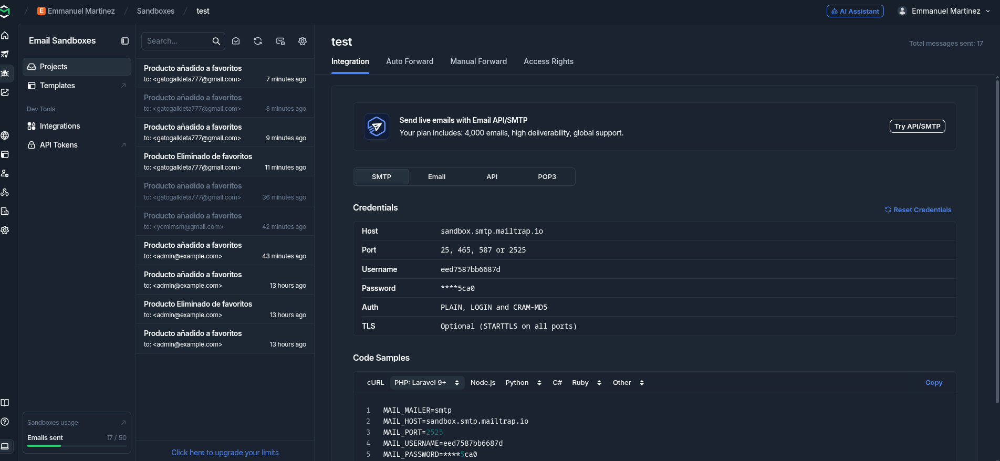
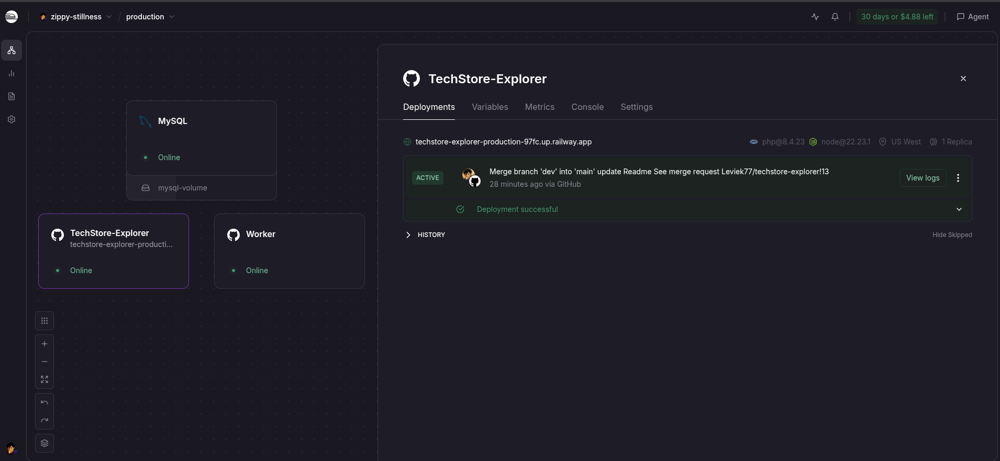

# TechStore Explorer

Aplicación desarrollada con Laravel que permite explorar productos, gestionar una wishlist, autenticación de usuarios, envío de correos mediante Mailtrap, dashboard administrativo y una API REST protegida con Laravel Sanctum.

---

# Requisitos

* PHP 8.5+
* Composer
* Node.js 20+
* pnpm (recomendado) o npm
* MySQL
* Git

---

# Instalación

## 1. Clonar el repositorio

```bash
git clone git@gitlab.com:usuario/TechStore-Explorer.git
cd TechStore-Explorer
```

## 2. Instalar dependencias

### Backend

```bash
composer install
```

### Frontend

El proyecto fue desarrollado utilizando **pnpm**, aunque también es compatible con **npm**.

Con **pnpm** (recomendado):

```bash
pnpm install
```

o con **npm**:

```bash
npm install
```

## 3. Configurar variables de entorno

Crear el archivo `.env`

```bash
cp .env.example .env
```

Generar la llave de la aplicación

```bash
php artisan key:generate
```

## 4. Configurar la base de datos

Actualizar las variables correspondientes en `.env`

```env
DB_CONNECTION=mysql
DB_HOST=127.0.0.1
DB_PORT=3306
DB_DATABASE=techexplorer
DB_USERNAME=root
DB_PASSWORD=password
```

## 5. Ejecutar migraciones y seeders

```bash
php artisan migrate --seed
```

## 6. Compilar assets

Con **pnpm** (recomendado):

```bash
pnpm dev
```

Para producción:

```bash
pnpm build
```

También es posible utilizar **npm**:

```bash
npm run dev
```

o

```bash
npm run build
```

## 7. Levantar el servidor

```bash
php artisan serve
```

### 8. Ejecutar el worker de colas

El proyecto utiliza las **colas de Laravel** para procesar el envío de correos de manera asíncrona. Para que los correos generados por la aplicación sean enviados correctamente, es necesario mantener activo el worker de Laravel.

Ejecutar en una terminal adicional:

```bash
php artisan queue:work
```

La aplicación estará disponible en:

```
http://127.0.0.1:8000
```

---

# Variables de entorno de ejemplo

```env
APP_NAME=TechStore
APP_ENV=local
APP_DEBUG=true
APP_URL=http://127.0.0.1:8000

DB_CONNECTION=mysql
DB_HOST=127.0.0.1
DB_PORT=3306
DB_DATABASE=techexplorer
DB_USERNAME=root
DB_PASSWORD=password

MAIL_MAILER=smtp
MAIL_HOST=sandbox.smtp.mailtrap.io
MAIL_PORT=2525
MAIL_USERNAME=your_username
MAIL_PASSWORD=your_password
MAIL_ENCRYPTION=tls
MAIL_FROM_ADDRESS=no-reply@example.com
MAIL_FROM_NAME="${APP_NAME}"
```

---

## Pruebas de correo con Mailtrap

Para el desarrollo del proyecto se utilizó **Mailtrap** con un **Sandbox SMTP**, lo que permite interceptar todos los correos enviados por la aplicación sin entregarlos a direcciones reales.

Una vez configuradas las credenciales SMTP en el archivo `.env`, los correos enviados al agregar o eliminar productos de la wishlist pueden visualizarse directamente desde la bandeja de entrada (Inbox) del Sandbox de Mailtrap.

### Bandeja de entrada


---
## Despliegue en Railway

[Repositorio Gitlab](https://gitlab.com/Leviek77/techstore-explorer.git)

Para realizar el despliegue del proyecto se creó un **repositorio espejo en GitHub**, debido a que la integración directa entre GitLab y Railway no se encontraba disponible para este proyecto.

El repositorio espejo mantiene sincronizado el código fuente y permite que Railway realice los despliegues automáticos mediante la integración con GitHub.

La aplicación se encuentra desplegada en **Railway** utilizando una arquitectura compuesta por tres servicios:

- **Servicio Web:** Ejecuta la aplicación Laravel y atiende las peticiones HTTP de los usuarios.
- **Base de datos MySQL:** Gestiona la persistencia de la información de la aplicación.
- **Worker:** Ejecuta `php artisan queue:work` de forma continua para procesar tareas asíncronas, como el envío de correos electrónicos mediante la cola de Laravel.

Esta configuración permite separar las responsabilidades de la aplicación, evitando bloquear las solicitudes del usuario mientras se ejecutan procesos secundarios como el envío de correos.

### Arquitectura del despliegue



---
## Colección de Postman

Para facilitar las pruebas de la API se proporciona una colección de Postman con los endpoints disponibles del proyecto.

La colección se encuentra disponible en el siguiente enlace:

[Postman Collection](https://hemmanuelmtz777-3951561.postman.co/workspace/Emmanuel-Martinez's-Workspace~4e059709-7713-47f7-80be-48cea93a5596/collection/48889292-550d0864-432b-4b94-9e42-bf4d6920de48?action=share&creator=48889292)

> La colección se comparte en modo lectura, por lo que los usuarios no cuentan con permisos de edición. Sin embargo, es posible ejecutar todas las peticiones disponibles, realizar pruebas de los endpoints y configurar las variables necesarias dentro de su propia instancia de Postman.

### Autenticación

Antes de ejecutar las peticiones protegidas, es necesario autenticarse mediante el endpoint de login.

El token generado por la autenticación deberá copiarse y configurarse en Postman para las demás solicitudes:

1. Ejecutar la petición de login.
2. Copiar el token recibido en la respuesta.
3. En las peticiones que requieran autenticación, ir a la pestaña **Authorization**.
4. Seleccionar el tipo de autenticación **Bearer Token**.
5. Colocar el token obtenido en el campo correspondiente.

Cada usuario debe configurar su propio token dentro de Postman, ya que estos valores son personales y no se incluyen dentro de la colección compartida.

---


# API REST

La API utiliza autenticación mediante **Laravel Sanctum**.

## Autenticación

### Registrar usuario

```
POST /api/register
```

### Iniciar sesión

```
POST /api/login
```

Devuelve un **Bearer Token** que debe enviarse en los endpoints protegidos.

---

## Wishlist

**Requiere autenticación.**

### Obtener wishlist

```
GET /api/wishlist
```

### Agregar producto

```
POST /api/wishlist
```

Body:

```json
{
    "product_id": 1
}
```

### Eliminar producto

```
DELETE /api/wishlist
```

Body:

```json
{
    "product_id": 1
}
```

---

## Roles

**Requiere:**

* Bearer Token
* Usuario con rol **admin**

### Obtener roles

```
GET /api/roles
```

### Crear rol

```
POST /api/roles
```

### Obtener un rol

```
GET /api/roles/{id}
```

### Actualizar rol

```
PUT /api/roles/{id}
```

### Eliminar rol

```
DELETE /api/roles/{id}
```

---

# Credenciales de prueba

## Administrador

```
Email:
admin@example.com

Password:
admin123
```

## Cliente

```
Email:
test@example.com

Password:
customer123
```

---

# Autenticación de la API

Después de iniciar sesión, el token debe enviarse en cada petición protegida mediante el encabezado:

```
Authorization: Bearer TU_TOKEN
```

---

# Tecnologías utilizadas

* Laravel 13
* Livewire
* Vue 3
* Tailwind CSS
* Laravel Sanctum
* Mailtrap
* MySQL
* Chart.js
* Vue Chart.js

---

# Uso de IA

Durante el desarrollo utilicé herramientas de IA como apoyo para resolver dudas técnicas, acelerar tareas repetitivas y comprender tecnologías con las que tenía poca experiencia previa. Todas las sugerencias fueron revisadas y adaptadas antes de incorporarlas al proyecto.

En particular, la IA me ayudó en:

* Resolver un problema de configuración de Git al migrar el repositorio de HTTPS a SSH, ya que inicialmente no podía subir cambios a GitLab.
* Revisar la ortografía y redacción de los mensajes de commit siguiendo buenas prácticas.
* Analizar errores de Laravel, PHP y otras herramientas para comprender el origen del problema y obtener posibles soluciones antes de implementarlas manualmente.
* Comprender el flujo de trabajo de Livewire, tecnología con la que no tenía experiencia previa, especialmente para decidir cuándo reutilizar componentes y cuándo desarrollar una solución desde cero.
* Utilizar sugerencias y autocompletados durante el desarrollo. No todas las sugerencias fueron aceptadas, ya que en ocasiones proponían importaciones o implementaciones incorrectas que fueron descartadas tras revisarlas.

La lógica de negocio, la arquitectura del proyecto, la implementación de la API REST con Laravel Sanctum, el sistema de roles, la wishlist, el dashboard, la autenticación, la integración con Mailtrap y las decisiones de diseño fueron desarrolladas y adaptadas manualmente.

Aunque hubo un problema que no pude solucionar y era que al parecer mi equipo bloqueava las imagenes de la api, se implemento una solucion donde si falla al traer la imagen se utiliza otra, aunque aclaro que en produccion no sucede este problema.